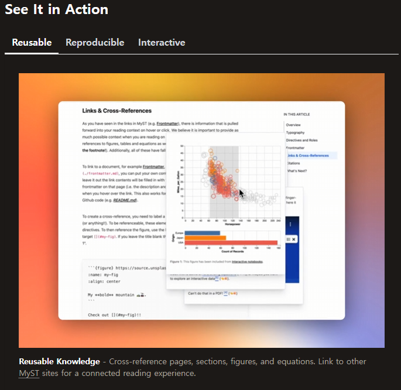
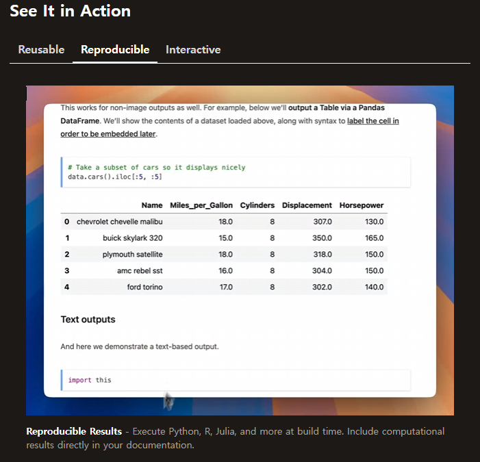
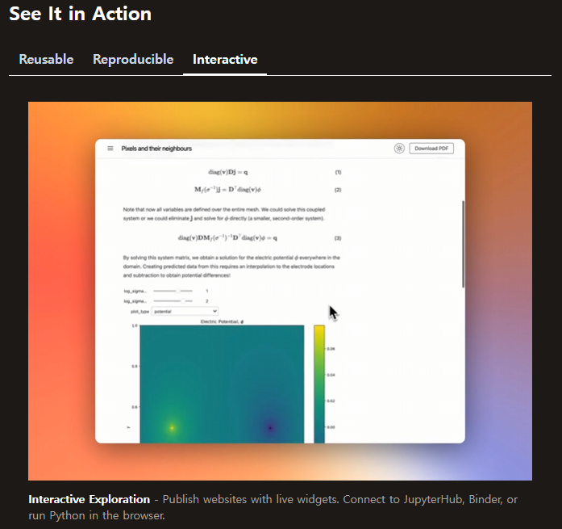
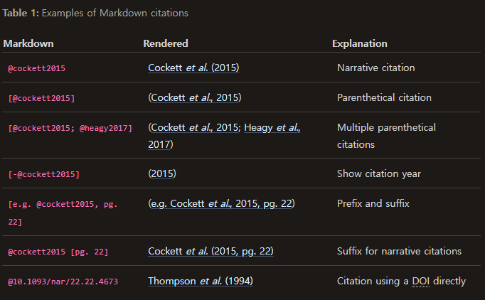

---
jupytext:
  text_representation:
    extension: .md
    format_name: myst
    format_version: 0.13
    jupytext_version: 1.18.1
---

# Intro
`Jupyter Book`을 사용하는 방법을 익히고, 실제로 사용하도록 실습하는 것을 목표로한다.
또한 Jupyter Book의 기반이 되는 MyST엔진의 문법을 익힌다.

# Jupyter Book

MyST의 엔진을 사용한 문서/출판 플랫폼 <doi:10.5281/ZENODO.14805610>
[Link1](https://mystmd.org/guide/)
[Link2](https://proceedings.scipy.org/articles/NKVC9349) 
:::{card} MyST
:link: https://mystmd.org
해당 사이트에서 MyST의 문법에 대해서 더 자세하게 알 수 있다.

The entire card can be clicked to navigate to `mystmd.org`.
:::


[AST](https://en.wikipedia.org/wiki/Abstract_syntax_tree) : AST는 추상 구문 구조(abstract syntax tree)의 약자로 컴퓨터가 코드를 이해하는데 필요한 구조이다.
```{mermaid}

flowchart LR
  A[Jupyter Notebook] --> C
  B[MyST Markdown] --> C
  C(mystmd) --> D{AST}
  D <--> E[LaTeX]
  E --> F[PDF]
  D --> G[Word]
  D --> H[React]
  D --> I[HTML]
  D <--> J[JATS]
```
이것을 통해서 어떤것을 할 수 있는가?


::::{tab-set}
:::{tab-item} Reusable


:::
:::{tab-item} Reproducible

:::

:::{tab-item} Interactive


::::

또한 문서를 만들어 웹에 게시하거나, 게시된 웹에서 작동 되도록 만들 수도 있다.
MyST가 어떤 점이 장점인지는 다음 동영상을 통해서 확인해 볼 수 있다.

::::{note} [Youtube](https://www.youtube.com/watch?v=yYcQf-Yq8B0)
:class:dropdown
:::{iframe} https://www.youtube.com/watch?v=yYcQf-Yq8B0
:width: 100%
:::
::::

## How to start
필요한 것
- python
- [가상환경][venv]

`가상환경`을 만들어 주고 그 환경에서 `jupyter`를 설치해 준다.

::::{tab-set}
:::{tab-item} Unix/MacOS
:sync: tab1
```bash
python3 -m venv .venv
```
여기서 `.venv`를 원하는 이름으로 작성해도 된다.
:::
:::{tab-item} Windows
:sync: tab2
```bash
py -m venv .venv
```
여기서 `.venv`를 원하는 이름으로 작성해도 된다.
:::
::::
가상환경을 만들어 준 후 `가상환경`을 `Activate`해주면 된다.
::::{tab-set}
:::{tab-item} Unix/MacOS
:sync: tab1
```bash
source .venv/bin/activate
```
여기서 `.venv`가 아닐 경우 만들어둔 `가상환경`의 이름에 해당된다.
:::
:::{tab-item} Windows
:sync: tab2
```bash
.venv\Scripts\activate
```
여기서 `.venv`가 아닐 경우 만들어둔 `가상환경`의 이름에 해당된다.
:::
::::

가상환경을 활성화 해준 상태에서 `jupyter book`을 설치해 준다.

```{code} bash
:filename: install
pip install jupyter-book
jupyter book start
```

만약 정상적으로 실행이 된다면

```text
🐕 Fetching template metadata from https://api.mystmd.org/templates/site/myst/book-theme
💾 Saved template to path _build/templates/site/myst/book-theme
⤵️ Installing web libraries (can take up to 60 s)
📦 Installed web libraries in 13 s
📖 Built interactive-graphs.ipynb in 21 ms.
📖 Built paper.md in 32 ms.
📖 Built README.md in 35 ms.
📚 Built 3 pages for myst in 82 ms.

  ✨✨✨  Starting Book Theme  ✨✨✨

⚡️ Compiled in 524ms.

🔌 Server started on port 3000!  🥳 🎉

  👉  http://localhost:3000  👈
```
이런 문서가 뜰 것이다.

하지만 파일이 아무것도 없거나 `npm`등이 안깔려 있을 경우 에러가 뜰 것이다.
이후 초기화 해줄때는 `jupyter book init`을 입력하거나. [Jupyter Book](https://jupyterbook.org/stable/get-started/init/)링크를 참고하면 된다.


:::::{note} 추가로 설치 할 수 있는것
:class:dropdown
::::{grid} 1 2 2 2

:::{card}
:header: Install with `pip` 🐍

In a [virtual environment][venv]:

```shell
pip install "jupyter-book>=2.0.0a0"
```

:::

:::{card}
:header: Install with [`mamba`][mamba] / `conda` 🔥

```{warning}
Jupyter Book 2 is not yet released on `conda-forge`. Stay tuned!
```

```shell
mamba install -c conda-forge \
"jupyter-book>=2"
```

:::

:::{card}
:header: Install with [`pipx`][pipx] ⚙️

Never heard of `pipx`? See [the documentation][pipx] for more.

```shell
pipx install "jupyter-book>=2.0.0a0"
```

:::

:::{card}
:header: Install with [`uv`][uv] 🚀

Never heard of `uv`? See [the documentation][uv] for more.

```shell:
uv add "jupyter-book>=2.0.0a0"
```

:::

:::{card}
:header: Install with [`pixi`][pixi] 🔥

```{warning}
Jupyter Book 2 is not yet released on `conda-forge`. Stay tuned!
```

Never heard of `pixi`? See [the documentation][pixi] for more.

```shell:
pixi add "jupyter-book>=2"
```

:::
    
:::{card}
:header: Install with [`npm`][npm] 🔥

Never heard of `npm`? See [the documentation][npm] for more.

```shell:
npm install -g "jupyter-book@>=2.0.0-a0"
```

:::

::::
:::::


:open:

https://proceedings.scipy.org/articles/hwcj9957

https://mystmd.org/guide

## Executable note?
실시간으로 시연이 가능한 노트를 사용할 수 있지만, `MyST`의 문법을 알고 있어야 보다 효율적으로 사용할 수 있다. 이번 발표에서는 가장 기본적인 내용 위주로 확인해 볼 것이다.
더 자세한 내용은 위의 각주 부분에서 [^MyST]문법을 확인해 볼 수 있다. MyST의 문법은 기본적인 `markdown` 문법에 더불어 `MyST`에서 사용가능 한 명령어들이 추가된 형태라고 볼 수 있다.

각주를 사용하는 방법은 아래의 `code-block`을 사용하면 된다.
```
어떤 문장[^아무이름]으로 입력이 가능하다.
[^아무이름]: 이 각주를 설명하는 구조
```
[^MyST]: [MyST](https://mystmd.org/guide/syntax-overview#skip-to-frontmatter)의 문법을 설명하는 글과 [비디오]( https://youtu.be/F3st8X0L1Ys?si=xWiAI85CPEUfkRZ8) 이다.`MyST`는 자동적으로 각주가 아랫 부분에 내려가게 된다. 또한 각주에 다른 `_.md`파일이나 `_.ipynb`을 [링크](./99_test.md)를 걸 수 있다.


## MyST 문법 및 입력 방법

(equation-input)=
### 수식 입력
수식을 여러 곳에서 사용할 수 있다. 

:::{note}사용가능 한 문법
- $\LaTeX$
- `$`로 감싸는 문법
- `$$`로 감싸는 문법
- `MyST`문법
:::

```md
$$
A =  a x + b 
$$ (eq:temp)
```
$$
A =  a x + b 
$$ (eq:temp)

```latex
\begin{equation}
m\ddot{\theta}_i + \dot{\theta}_i = \Omega_i + \frac{K}{N}\sum_j \sin(\theta_j - \theta_i),
\label{eq:eq_of_motion}
\end{equation}
```
\begin{equation}
m\ddot{\theta}_i + \dot{\theta}_i = \Omega_i + \frac{K}{N}\sum_j \sin(\theta_j - \theta_i),
\label{eq:eq_of_motion}
\end{equation}

이런식으로 수식을 입력이 가능하며, 해당 부분을 본문에 인용하려면  $\LaTeX$에서 `\ref{eq:temp}`를 사용하는 것과 비슷하게  `{ref}`를 사용가능하다. "Eq. {ref}`eq:eq_of_motion`" 또한 `[](#eq:eq_of_motion)`을 사용하여 같은 결과를 얻을 수 있다. "Eq. [](#eq:eq_of_motion)"

또한 본문의 수식의 순서가 달라지면 자동으로 변경되며, [다른 페이지](./99_test.md)에서 해당 수식을 인용도 가능하다.

### Table
`Markdown`문법으로 표를 작성할 수 있으며, `MyST`문법을 사용해서 `label` 및 caption을 넣을 수 있다. 또한 `CSV` 형태나, `HTML` 형태 역시 가능하다.
::::MyST
:::{table} Table caption
:label: tbl:table
:align: center

| foo | bar |
| --- | --- |
| baz | bim |

:::
::::
:::{table} Table caption
:label: tbl:table
:align: center

| foo | bar |
| --- | --- |
| baz | bim |

:::

:::{table} Area Comparisons (written in fancy HTML)
:label: tbl:areas-html
HTML형태로 작성된 테이블블
<table>
   <tr>
      <th rowspan="2">Projection</th>
      <th colspan="3" align="center">Area in square miles</th>
   </tr>
   <tr>
      <th align="right">Large Horizontal Area</th>
      <th align="right" style="background: -webkit-linear-gradient(20deg, #09009f, #E743D9); -webkit-background-clip: text; -webkit-text-fill-color: transparent;">Large Vertical Area</th>
      <th align="right">Smaller Square Area
      <th>
   </tr>
   <tr>
      <td>Albers Equal Area</td>
      <td align="right">7,498.7</td>
      <td align="right">10,847.3</td>
      <td align="right">35.8</td>
   </tr>
   <tr>
      <td>Web Mercator</td>
      <td align="right">13,410.0</td>
      <td align="right">18,271.4</td>
      <td align="right">63.0</td>
   </tr>
   <tr>
      <td>Difference</td>
      <td align="right" style="background-color: red;color: white">5,911.3</td>
      <td align="right">7,424.1</td>
      <td align="right">27.2</td>
   </tr>
   <tr>
      <td>
         <bold>Percent Difference</bold>
      </td>
      <td align="right" style="background-color: green;color: white">44%</td>
      <td align="right">41%</td>
      <td align="right">43%</td>
   </tr>
</table>
:::


해당 부분 역시 `{ref}`를 사용해서 인용을 할 수 있으며, [다른 문서](99_test.md)에서도 인용이 가능하다.

(sec:input_fig)=
### 그림 입력
`Markdown` 문법을 사용할 수 있으며
```

```
`{image}`를 사용해서 이미지를 넣을 수 있으며, 아쉽게도 $\LaTeX$문법은 사용할 수 없다.

::::
```{figure} https://github.com/rowanc1/pics/blob/main/sunset.png?raw=true
:label: fig:myFigure
:alt: Sunset at the beach
:align: center

Relaxing at the beach 🏝 🌊 😎
```

::::
```{figure} https://github.com/rowanc1/pics/blob/main/sunset.png?raw=true
:label: fig:myFigure
:alt: Sunset at the beach
:align: center

Relaxing at the beach 🏝 🌊 😎
```
해당 그림의 인용은 `[](fig:myfig)`를 하거나 `{ref}`를 사용할 수 있다. "{ref}`fig:myFigure`"
Figure의 순서는 그림의 위치가 변경되면 자동으로 바뀐다.

[다른 문서](99_test.md)에서 그림을 인용하는 경우 `label`이 유일할 경우 가능하며, 같은 방법으로 가능하다.


### 동영상 입력
동영상을 파일을 넣거나, `Youtube`같은 동영상 플랫폼을 사용 가능하다.
파일을 넣는 경우  `mp4`파일을 직접 넣어준 후 `{figure}` 혹은 ``을 사용해 넣을 수 있다.

::::
:::{figure} ./Image_video/Lx128Ly128alpha-1beta1eta0.10.mp4
:label: vid:vicsek_model

caption $L_x=L_y=128,\alpha=-1,\beta=1,\eta=0.1$에서의 3종의 vicsek model 시뮬레이션 동영상. 붉은 색은 R, 초록색은 S, 파랑색은 P에 해당된다.
:::
::::

:::{figure} ./Image_video/Lx128Ly128alpha-1beta1eta0.10.mp4
:label: vid:vicsek_model

caption $L_x=L_y=128,\alpha=-1,\beta=1,\eta=0.1$에서의 3종의 vicsek model 시뮬레이션 동영상. 붉은 색은 R, 초록색은 S, 파랑색은 P에 해당된다.
:::

If you have ffmpeg installed, you may also include `.mov` and `.avi` video files, and MyST will convert them to .mp4 and include them. Videos can also be used in the image or even in simple Markdown image.

동영상의 경우도 `{ref}` 혹은 `[](#vid:vicsek_model)` 으로 인용이 가능하다. [](#vid:vicsek_model)

#### YouTube
`YouTube`의 경우 `{iframe}`을 사용해서 동영상 링크를 넣어 embedding이 가능하다.

::::
:::{iframe} https://www.youtube.com/embed/F3st8X0L1Ys
:width: 100%
Get up and running with MyST in Jupyter!
:::
::::

:::{iframe} https://www.youtube.com/embed/F3st8X0L1Ys
:width: 100%
Get up and running with MyST in Jupyter!
:::


### Callouts
markdown을 작성하다가 어떤 문장을 `강조`하고 싶을때, Callouts를 사용이 가능하다. 
사용가능한 callout의 종류는 다음과 같다.

```{list-table} Named admonitions that can be used as directives
:label: admonitions-list
* - 🔵 `{note}`
  - 🟠 `{attention}`
* - 🔵 `{important}`
  - 🟠 `{caution}`
* - 🟢 `{hint}`
  - 🟠 `{warning}`
* - 🟢 `{seealso}`
  - 🔴 `{danger}`
* - 🟢 `{tip}`
  - 🔴 `{error}`
```
::::::{tab-set}

:::::{tab-item} Note
::::{myst}
```{note}
This is a note admonition
```
::::
```{note}
This is a note admonition
```
:::::

:::::{tab-item} Important
::::{myst}
```{important}
This is an important admonition
```
::::
```{important}
This is an important admonition
```
:::::

:::::{tab-item} Hint
::::{myst}
```{hint}
This is a hint admonition
```
::::
```{hint}
This is a hint admonition
```
:::::

:::::{tab-item} See Also
::::{myst}
```{seealso}
This is a seealso admonition
```
::::
```{seealso}
This is a seealso admonition
```
:::::

:::::{tab-item} Tip
::::{myst}
```{tip}
This is a tip admonition
```
::::
```{tip}
This is a tip admonition
```
:::::

:::::{tab-item} Attention
::::{myst}
```{attention}
This is an attention admonition
```
::::
```{attention}
This is an attention admonition
```
:::::

:::::{tab-item} Caution
::::{myst}
```{caution}
This is a caution admonition
```
::::
```{caution}
This is a caution admonition
```
:::::

:::::{tab-item} Warning
::::{myst}
```{warning}
This is a warning admonition
```
::::
```{warning}
This is a warning admonition
```
:::::

:::::{tab-item} Danger
::::{myst}
```{danger}
This is a danger admonition
```
::::
```{danger}
This is a danger admonition
```
:::::

:::::{tab-item} Error
::::{myst}
```{error}
This is an error admonition
```
::::
```{error}
This is an error admonition
```
:::::

::::::


(Code_Code-blocks)=
### Code & Code-blocks

code block은 문서네에 `Code`를 넣을 경우 사용된다.

`code-block`은 단순하게 `:`혹은 `'`를 3개 사용한 다음 프로그램 언어를 붙여서 사용 가능하다

::::::{tab-set}
:::::{tab-item} python
::::{myst}
```python
import matplotlib.pyplot as plt

plt.plot([1, 2, 3], [1, 2, 3], 'go-', label='line 1', linewidth=2)
```
::::
```python
import matplotlib.pyplot as plt

plt.plot([1, 2, 3], [1, 2, 3], 'go-', label='line 1', linewidth=2)
```
:::::

:::::{tab-item} C
::::{myst}
```c
#include <stdio.h>

int main() {
    printf("Hello C!\n");
    return 0;
}
```
::::
```c
#include <stdio.h>

int main() {
    printf("Hello C!\n");
    return 0;
}
```
:::::

:::::{tab-item} C++
::::{myst}
```cpp
#include <iostream>
using namespace std;

int main() {
    cout << "Hello C++!" << endl;
    return 0;
}
```
::::
```cpp
#include <iostream>
using namespace std;

int main() {
    cout << "Hello C++!" << endl;
    return 0;
}
```
:::::

:::::{tab-item} C#
::::{myst}
```csharp
using System;

class Program {
    static void Main() {
        Console.WriteLine("Hello C#");
    }
}
```
::::
```csharp
using System;

class Program {
    static void Main() {
        Console.WriteLine("Hello C#");
    }
}
}
```
:::::

:::::{tab-item} Julia
::::{myst}
```julia
println("Hello Julia!")
```
::::
```julia
println("Hello Julia!")
```
:::::

:::::{tab-item} R
::::{myst}
```r
print("Hello R!")
```
::::
```r
print("Hello R!")
```
:::::
::::::

혹은 기존에 있는 `file`의 라인을 출력 할 수 있다.
::::{note} `{literalinclude} myst.yml` 결과
:class:dropdown
```{literalinclude} myst.yml
:lineno-match:
:emphasize-lines:21,
```
::::


만약 코드 번호를 넣고 싶으면 `:linenos:`를 사용해서 나타낼 수 있으며
::::{code} python
:linenos:
```python
:linenos:
import matplotlib.pyplot as plt

plt.plot([1, 2, 3], [1, 2, 3], 'go-', label='line 1', linewidth=2)
```
::::
특정 줄번호를 강조하고 싶으면 `:emphasize-lines: 번호`를 사용해서 특정 라인을 강조 할 수 있다.
::::{code} python
:linenos:
:emphasize-lines:2,3,6
```python
:linenos:
:emphasize-lines:2,3,6
import matplotlib.pyplot as plt

plt.plot([1, 2, 3], [1, 2, 3], 'go-', label='line 1', linewidth=2)
```
::::

또한 코드블록을 `:label:`을 달아 인용을 할 수 있으며, `:caption:`을 걸어서 인용할 수 있다.
::::{code} python
:linenos:
:emphasize-lines:2-5,8
:label: example-code
:caption: caption및 label을 설명하기 위한 코드블럭
```python
:linenos:
:emphasize-lines:2-5,8
:label: example-code
:caption: caption및 label을 설명하기 위한 코드블럭
import matplotlib.pyplot as plt

plt.plot([1, 2, 3], [1, 2, 3], 'go-', label='line 1', linewidth=2)
```
::::

또한 이전과 같은 `{ref}`혹은 `[](#label)`을 통해서 인용을 할 수 있다.
> `{ref}` {ref}`example-code`  
> `[](#label)` {ref}`example-code`

또한 ``을 사용해서 해당 부분을 임베딩할 수 있으며, 같은 프로젝크 내에 있는 [다른 문서](./99_test.md)에서도 인용 및 임베딩 할 수 있다.


(subsec:Header-Targets)=
### Header Targets
`Markdown`문서를 작성하면서 chapter, section, subsection을 나눌 수 있다. 나누는 방법은 `#`의 개수를 통해서 나눌 수 있다.

`#` Header and chapter
:::{myst} 
`#` `H1`: Capter에 해당된다.
# Capter Title
`##` `H2`: Section에 해당된다.
## Section Title
`###` `H3` : Subsection에 해당된다.
### Subsection title
`####` `H4` : 추가적으로 설명하기 위해서 사용된다.
#### Example
`#####` `H5`: 더 자세하게 설명한 내용을 추가한다.
##### test
:::

또한 $\LaTeX$에서 `section`,`chpater`의 라벨을 다는 것과 같이 라벨을 걸어 줄 수 있다. 해당 방법은 `(sec:label)=`을 해더 앞에 넣어준다.
:::MyST
=(sec:label)
## Section title
:::
또한 `{ref}`를 통해서 해당 해더로 이동 할 수 있다.
{ref}`subsec:Header-Targets`
또한 헤더의 번호를 해당 문서의 번호를 넣는 옵션을 선택할 수 있다.
:::MyST
---
numbering:
  heading_1: False # H1의 번호를 끈다.
  heading_2: true  # H2의 번호를 킨다.
  heading_3: true  # H3의 번호를 킨다.
---
:::


## 참고 문헌 인용
`DOI`를 다음과 같이 붙여 넣는것으로 사용 가능하며
```
[Cockett, 2022](https://doi.org/10.5281/zenodo.6476040).
```
[Cockett, 2022](https://doi.org/10.5281/zenodo.6476040).


`<doi:10.5281/zenodo.6476040>` 혹은 `[](doi:10.5281/zenodo.6476040),`
으로도 인용이 가능하다.

인용한 `DOI`들을 `bib`파일 형태로 바꿀 수 있는데
```
myst build --doi-bib
```
 `Jupyter Book`에서는 가능 하지 않을 가능성이 높다.

이미 만들어진 `bib`파일에서 인용하는 경우는 `jupyter book init`을 통해 만들어진 `myst.yml`나 문서의 첫 부분 `---`에 다음 부분을 추가해 주어야 한다.

:::
bibliography:
  - my_references.bib
  - https://example.com/my/remote/bibtex.bib
:::
인용할 경우 $\LaTeX$ `\cite{}` 문법과 비슷하게 `[@참고문헌]` 혹은 `{cite}`를 사용해 주면 된다.


:::
~~ {cite}`odor2019critical,arenas2008synchronization`.
:::
:::{tip} 인용 결과
Synchronization is a significant phenomenon observed in various natural and artificial systems, expressed through phenomena such as coordinated chemical reactions  {cite}`zaikin1970concentration`, heartbeats   {cite}`plonsey1987mathematical_heartmodeling`, neural reactions    {cite}`breakspear2010generative`, and metronome synchronization {cite}`pantaleone2002synchronization,goldsztein2021synchronization`. Large-scale synchronization in complex networks, including connectome and small-world structures, has also been investigated    {cite}`odor2019critical,arenas2008synchronization`.
:::
```
@zaikin1970concentration
```
@zaikin1970concentration

더 자세한 인용 방법은 해당 [사이트](https://mystmd.org/guide/citations)에서 확인이 가능하다.


### Wikipedia
<wiki:Wikipedia>와 같은 홈페이지를 띄우도록 만들 수 있다.


예를 들어 아래와 같이 Wikipedia의 링크를 첨부할 수있다.
> [복잡계](wiki:complexity_science)는 대단히 재밌다. 

하는 방법은 `<wiki:title>`으로 인용을 하거나 `[text](wiki:The_Big_Bang_Theory)`로 인용하는 방법이 있다.
>`<wiki:title>` <wiki:Apple>  
>`[text](wiki:The_Big_Bang_Theory)` [text](wiki:The_Big_Bang_Theory)

여기서 제목에 띄어쓰기가 들어가는 경우 `_`로 단어사이를 띄어준다.


[mamba]: https://mamba.readthedocs.io/en/latest/
[pixi]: https://pixi.sh/
[pipx]: https://pipx.pypa.io/stable/
[venv]: https://packaging.python.org/en/latest/guides/installing-using-pip-and-virtual-environments/
[npm]: https://docs.npmjs.com/downloading-and-installing-node-js-and-npm/
[uv]: https://docs.astral.sh/uv/
