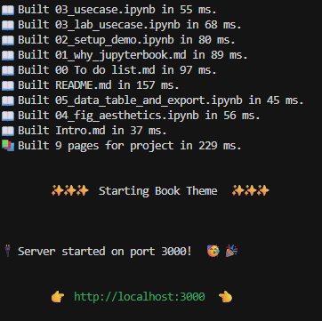

# Jupyter Book
MyST(Markedly Structured Text)의 엔진을 사용한 문서/출판 플랫폼
<doi:10.5281/ZENODO.14805610>
https://proceedings.scipy.org/articles/NKVC9349

```{mermaid}
flowchart LR
  A[Jupyter Notebook] --> C
  B[MyST Markdown] --> C
  C(mystmd) --> D{AST}
  D <--> E[LaTeX]
  E --> F[PDF]
  D --> G[Word]
  D --> H[React]
  D --> I[HTML]
  D <--> J[JATS]
```
이것을 통해서 어떤것을 할 수 있는가?


::::{tab-set}
:::{tab-item} Reusable
:sync: tab1


:::
:::{tab-item} Reproducible
:sync: tab2

:::

:::{tab-item} Interactive
:sync: tab1


::::

또한 문서를 만들어 웹에 게시하거나, 게시된 웹에서 작동 되도록 만들 수도 있다.

## How to start
https://proceedings.scipy.org/articles/hwcj9957

https://mystmd.org/guide
:::{card} Jupyter
:link: ./02-myst-markdown-basics.ipynb
Include figures and equations in your documents, easily cross-referencing content throughout your website, article or paper.
:::

:::{card} 🪐 Inline Execution
:link: ./03-inline-interactivity.ipynb
You can use the `{eval}` role to evaluate variables directly inside of your markdown cells, including widgets, sparklines and other variables.
:::

:::{card} 🏷 Adding Frontmatter
:link: ./04-myst-frontmatter.ipynb
You can add frontmatter like math macros, abbreviations, and information about title, authors, licenses, and affiliations.
:::

## Executable note?
실시간으로 시연이 가능한 노트를 사용할 수 있지만, `MyST`의 문법을 알고 있어야 보다 효율적으로 사용할 수 있다. 이번 발표에서는 가장 기본적인 내용 위주로 확인해 볼 것이다.
더 자세한 내용은 위의 각주 부분에서 [^MyST]문법을 확인해 볼 수 있다. MyST의 문법은 기본적인 `markdown` 문법에 더불어 `MyST`에서 사용가능 한 명령어들이 추가된 형태라고 볼 수 있다.

각주를 사용하는 방법은 아래의 `code-block`을 사용하면 된다.
```
어떤 문장[^아무이름]으로 입력이 가능하다.
[^아무이름]: 이 각주를 설명하는 구조
```
[^MyST]: [MyST](https://mystmd.org/guide/syntax-overview#skip-to-frontmatter)의 문법을 설명하는 글과 [비디오]( https://youtu.be/F3st8X0L1Ys?si=xWiAI85CPEUfkRZ8) 이다.`MyST`는 자동적으로 각주가 아랫 부분에 내려가게 된다. 또한 각주에 다른 `_.md`파일이나 `_.ipynb`을 [링크](./test.md)를 걸 수 있다.


## 입력 방법

### 수식 입력
수식을 여러 곳에서 사용할 수 있다. 

:::{note}사용가능 한 문법
- $\LaTeX$
- `$`로 감싸는 문법
- `$$`로 감싸는 문법
- `MyST`문법
:::

```md
$$
A =  a x + b 
$$ (eq:temp)
```
$$
A =  a x + b 
$$ (eq:temp)

```latex
\begin{equation}
m\ddot{\theta}_i + \dot{\theta}_i = \Omega_i + \frac{K}{N}\sum_j \sin(\theta_j - \theta_i),
\label{eq:eq_of_motion}
\end{equation}
```
\begin{equation}
m\ddot{\theta}_i + \dot{\theta}_i = \Omega_i + \frac{K}{N}\sum_j \sin(\theta_j - \theta_i),
\label{eq:eq_of_motion}
\end{equation}

이런식으로 수식을 입력이 가능하며, 해당 부분을 본문에 인용하려면  $\LaTeX$에서 `\ref{eq:temp}`를 사용하는 것과 비슷하게  `{ref}`를 사용가능하다. "Eq. {ref}`eq:eq_of_motion`" 또한 `[](eq:eq_of_motion)`을 사용하여 같은 결과를 얻을 수 있다. "Eq. [](eq:eq_of_motion)"

또한 본문의 수식의 순서가 달라지면 자동으로 변경되며, [다른 페이지](./test.md)에서 해당 수식을 인용도 가능하다.

### Table
`Markdown`문법으로 표를 작성할 수 있으며, `MyST`문법을 사용해서 `label` 및 caption을 넣을 수 있다. 또한 `CSV` 형태나, `HTML` 형태 역시 가능하다.
::::MyST
:::{table} Table caption
:label: tbl:table
:align: center

| foo | bar |
| --- | --- |
| baz | bim |

:::
::::
:::{table} Table caption
:label: tbl:table
:align: center

| foo | bar |
| --- | --- |
| baz | bim |

:::

:::{table} Area Comparisons (written in fancy HTML)
:label: tbl:areas-html
HTML형태로 작성된 테이블블
<table>
   <tr>
      <th rowspan="2">Projection</th>
      <th colspan="3" align="center">Area in square miles</th>
   </tr>
   <tr>
      <th align="right">Large Horizontal Area</th>
      <th align="right" style="background: -webkit-linear-gradient(20deg, #09009f, #E743D9); -webkit-background-clip: text; -webkit-text-fill-color: transparent;">Large Vertical Area</th>
      <th align="right">Smaller Square Area
      <th>
   </tr>
   <tr>
      <td>Albers Equal Area</td>
      <td align="right">7,498.7</td>
      <td align="right">10,847.3</td>
      <td align="right">35.8</td>
   </tr>
   <tr>
      <td>Web Mercator</td>
      <td align="right">13,410.0</td>
      <td align="right">18,271.4</td>
      <td align="right">63.0</td>
   </tr>
   <tr>
      <td>Difference</td>
      <td align="right" style="background-color: red;color: white">5,911.3</td>
      <td align="right">7,424.1</td>
      <td align="right">27.2</td>
   </tr>
   <tr>
      <td>
         <bold>Percent Difference</bold>
      </td>
      <td align="right" style="background-color: green;color: white">44%</td>
      <td align="right">41%</td>
      <td align="right">43%</td>
   </tr>
</table>
:::

해당 부분 역시 `{ref}`를 사용해서 인용을 할 수 있으며, [다른 문서](test.md)에서도 인용이 가능하다.


### 그림 입력
`Markdown` 문법을 사용할 수 있으며
```

```
`{image}`를 사용해서 이미지를 넣을 수 있으며, 아쉽게도 $\LaTeX$문법은 사용할 수 없다.

::::
```{figure} https://github.com/rowanc1/pics/blob/main/sunset.png?raw=true
:label: fig:myFigure
:alt: Sunset at the beach
:align: center

Relaxing at the beach 🏝 🌊 😎
```
::::
```{figure} https://github.com/rowanc1/pics/blob/main/sunset.png?raw=true
:label: fig:myFigure
:alt: Sunset at the beach
:align: center

Relaxing at the beach 🏝 🌊 😎
```
해당 그림의 인용은 `[](fig:myfig)`를 하거나 `{ref}`를 사용할 수 있다. "{ref}`fig:myFigure`"
Figure의 순서는 그림의 위치가 변경되면 자동으로 바뀐다.

[다른 문서](test.md)에서 그림을 인용하는 경우 `label`이 유일할 경우 가능하며, 같은 방법으로 가능하다.


### 동영상 입력
동영상을 파일을 넣거나, `Youtube`같은 동영상 플랫폼을 사용 가능하다.
파일을 넣는 경우  `mp4`파일을 직접 넣어준 후 `{figure}` 혹은 ``을 사용해 넣을 수 있다.

::::
:::{figure} ./Image_video/Lx128Ly128alpha-1beta1eta0.10.mp4
:label: vid:vicsek_model

caption $L_x=L_y=128,\alpha=-1,\beta=1,\eta=0.1$에서의 3종의 vicsek model 시뮬레이션 동영상. 붉은 색은 R, 초록색은 S, 파랑색은 P에 해당된다.
:::
::::

:::{figure} ./Image_video/Lx128Ly128alpha-1beta1eta0.10.mp4
:label: vid:vicsek_model

caption $L_x=L_y=128,\alpha=-1,\beta=1,\eta=0.1$에서의 3종의 vicsek model 시뮬레이션 동영상. 붉은 색은 R, 초록색은 S, 파랑색은 P에 해당된다.
:::

If you have ffmpeg installed, you may also include `.mov` and `.avi` video files, and MyST will convert them to .mp4 and include them. Videos can also be used in the image or even in simple Markdown image.

동영상의 경우도 `{ref}` 혹은 `[](#vid:vicsek_model)` 으로 인용이 가능하다. [](vid:vicsek_model)

#### YouTube
`YouTube`의 경우 `{iframe}`을 사용해서 동영상 링크를 넣어 embedding이 가능하다.

::::
:::{iframe} https://www.youtube.com/embed/F3st8X0L1Ys
:width: 100%
Get up and running with MyST in Jupyter!
:::
::::

:::{iframe} https://www.youtube.com/embed/F3st8X0L1Ys
:width: 100%
Get up and running with MyST in Jupyter!
:::

## 참고 문헌 인용
`DOI`를 다음과 같이 붙여 넣는것으로 사용 가능하며
```
[Cockett, 2022](https://doi.org/10.5281/zenodo.6476040).
```
[Cockett, 2022](https://doi.org/10.5281/zenodo.6476040).


`<doi:10.5281/zenodo.6476040>` 혹은 `[](doi:10.5281/zenodo.6476040),`
으로도 인용이 가능하다.

인용한 `DOI`들을 `bib`파일 형태로 바꿀 수 있는데
```
myst build --doi-bib
```
 `Jupyter Book`에서는 가능 하지 않을 가능성이 높다.

이미 만들어진 `bib`파일에서 인용하는 경우는 `jupyter book init`을 통해 만들어진 `myst.yml`나 문서의 첫 부분 `---`에 다음 부분을 추가해 주어야 한다.

:::
bibliography:
  - my_references.bib
  - https://example.com/my/remote/bibtex.bib
:::
인용할 경우 $\LaTeX$ `\cite{}` 문법과 비슷하게 `[@참고문헌]` 혹은 `{cite}`를 사용해 주면 된다.


:::
~~ {cite}`odor2019critical,arenas2008synchronization`.
:::
:::{tip} 인용 결과
Synchronization is a significant phenomenon observed in various natural and artificial systems, expressed through phenomena such as coordinated chemical reactions  {cite}`zaikin1970concentration`, heartbeats   {cite}`plonsey1987mathematical_heartmodeling`, neural reactions    {cite}`breakspear2010generative`, and metronome synchronization {cite}`pantaleone2002synchronization,goldsztein2021synchronization`. Large-scale synchronization in complex networks, including connectome and small-world structures, has also been investigated    {cite}`odor2019critical,arenas2008synchronization`.
:::
```
@zaikin1970concentration
```
@zaikin1970concentration

더 자세한 인용 방법은 해당 [사이트](https://mystmd.org/guide/citations)에서 확인이 가능하다.


## Cross-ref
다른 `.ipynb`에 있는 그림을 인용할 수 있다. 다른 `.ipynb`에 있는 그림을 인용하기 위해서는 아래와 같이
```python
#| label: img:test
points & bars
```
이런식으로 그림을 그려서 넣어서 `#|label: img:아무이름`으로 사용하면 되고, 그림을 그리는 경우는 기존 `Markdown`문법을 사용하거나 label과 caption을 넣기 위해서는 `MyST`문법을 사용하여 다음과 같이 그릴 수 있다.
::::
```{figure} #img:altair-horsepower
:label: fig-altair-horsepower
This figure has been included from [](./interactive-notebooks.ipynb) and can be referred to in cross-references through a different label.
```
::::
```{figure} #img:altair-horsepower
:label: fig-altair-horsepower
This figure has been included from [](./interactive-notebooks.ipynb) and can be referred to in cross-references through a different label.
```
:::{note} 해당 부분의 구조
`{figure} #img:example`
: `#` 은 이미 출력된 결과물을 인용하는 구조,  
`label`이 `img:example`이라고 출력한 결과를 가져온다.

`:label: fig-abcd`
: `:label:` 다음에 $\LaTeX$ 문법에서 사용하는 labeling과 동일하게 사용 가능

`This figure has been ~`
: caption에 해당되는 부분이며, 논문에 작성하 듯이 caption을 작성하면 됨
:::


라벨을 사용해 주는 경우, 해당 `label`이 다른 라벨과 겹치지 않아야 되며 다른 [문서](./test.md)에서도 사용이 가능하다.

:::{tip} 만약 그리만 넣고 싶을 경우
:class: dropdown
``을 사용해 주어 임베딩이 가능하며

`{ref}'example label'`
: 임의의 수식이나, 그림 등을 인용할 수 있다.
{ref}`img:altair-horsepower`
:::


### Interactive 

:::{code-block}
text = 'Hellow world'

:::
Some content

:::{code-block} cmd
pip install jupyter-block
:::


```{code-cell}
:tags: [raises-exception]
print("Hello" + 10001)
```

```{code-cell}
:tags: [skip-execution]

name = input("What is your name?")
print(name)
```

:::{code-cell} python
:label: markdown-myst
print("Here's some python!")
:::
이런식으로 하면 해당 결과에서 출력 된 결과물을 [하이퍼 링크](#markdown-myst)를 통해서 확인 해 볼 수 있다.
또한 해당 결과에서 출력된 결과를 확인해 보고 싶으면, 


:::{code-cell}
#| label : 시연용그래프
import numpy as np
import matplotlib.pyplot as plt

x = np.linspace(0,np.pi,10000)
y = np.cos(x)
plt.plot(x,y)
plt.xlabel(r'$x$',fontsize=15)
plt.ylabel(r'$y$',fontsize=15)
:::


:::{code-cell} cmd
:
jupyter book starrt
:::

**Figure1.**: 해당 그림은 


::: {note}
:class: dropdown
Temp text
format: jb-book
root: `README.md`
chapters:
  - file: 01_why_jupyterbook.md
  - file: 02_setup_demo
  - file: 03_usecase.ipynb
  - file: 04_fig_aesthetics.ipynb
:::