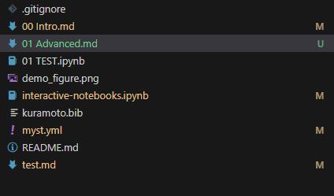
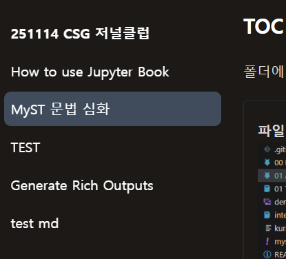
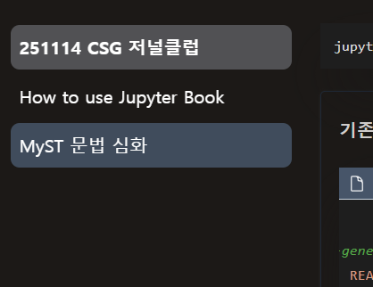

(sec:Proofs)=
## Proofs, Theorems and Algorithms

수학적 증명이나, 이 식이 어떻게 해서 나왔는지 정리해 놓고 나중에 찾을려고 하면 찾기 어렵다. 그럴 경우 해당 방법을 사용하면 도움이 될 것으로 보인다.

````{myst}
:::{prf:theorem} Orthogonal-Projection-Theorem
:label: my-theorem


Given $y \in \mathbb R^n$ and linear subspace $S \subset \mathbb R^n$,
there exists a unique solution to the minimization problem

```{math}
\hat y := \argmin_{z \in S} \|y - z\|
```

The minimizer $\hat y$ is the unique vector in $\mathbb R^n$ that satisfies

- $\hat y \in S$

- $y - \hat y \perp S$

The vector $\hat y$ is called the **orthogonal projection** of $y$ onto $S$.
:::
````
해당 부분은 [MyST](https://mystmd.org/guide/proofs-and-theorems) Proofs, Theorems and Algorithms의 부분에서 인용을 하였다. 


```{list-table} Proof kinds that can be used as directives
:label: proof-list
:header-rows: 0

* - `prf:algorithm`
  - `prf:axiom`
  - `prf:conjecture`
* - `prf:corollary`
  - `prf:criteria`
  - `prf:definition`
* - `prf:example`
  - `prf:lemma`
  - `prf:observation`
* - `prf:property`
  - `prf:proposition`
  - `prf:proof`
* - `prf:remark`
  - `prf:theorem`
  -
```
[{name}](#proof-list)표에서 어떤 `prf`를 사용할 수 있는지 확인할 수 있을 것으로 보인다.

### Example
Kuramoto model을 설명하는 `prf`를 다음과 같이 만들 수 있다.

:::{prf:definition} Kuramoto-Oscillator
:label: def:Kuramoto-model

The **Kuramoto model** describes a system of $N$ coupled phase oscillators  
with phases $\theta_i(t)$ and natural frequencies $\omega_i$ ({cite}`kuramoto1975self`):

```{math}
\dot{\theta}_i = \omega_i + \frac{K}{N}\sum_{j=1}^{N} \sin(\theta_j - \theta_i),
\qquad i = 1,\dots,N.
```

Here,
- $K$ is the coupling constant,
- $\omega_i$ are intrinsic frequencies sampled from a distribution $g(\omega)$.
:::
`{ref}`를 사용하거나 `@`,`[](#식이름)`을 사용해서 인용할 수 있다.
- `{ref}`, creates {ref}`def:Kuramoto-model`
- `[](#def:Kuramoto-model)`, creates [](#def:Kuramoto-model)
- `[{name}](#def:Kuramoto-model)` creates [{name}](#def:Kuramoto-model)
- `[{number}](#def:Kuramoto-model)` creates [{number}](#def:Kuramoto-model)
- `[See Theorem](#def:Kuramoto-model)` creates [See Theorem](#def:Kuramoto-model)
- `@def:Kuramoto-model` creates @def:Kuramoto-model

또한 이전과 동일하게 [다른 사이트](./99 test.md)에서도 사용 가능하다.


## Glossaries, Terms, Index Pages, and Abbreviations
어떤 정의들이 집합되어 있는 부분을 Glossaries, 이며, '{glossary}'에서 용어의 정의를 쓴것을 `{term}`으로 불러올 수 있다.

```{myst}
Glossaries are a collection of definitions for Terms in your documents.
Below is the example of a glossary defining the terms {term}`glossary`, {term}`term`, and {term}`Index`

:::{glossary}
glossary
: A glossary is a [list of terms and their definitions](https://en.wikipedia.org/wiki/Glossary).

term
: A term is a [word with a specialized meaning](https://en.wikipedia.org/wiki/Terminology).

index
: An [organized list of information in a publication](<https://en.wikipedia.org/wiki/Index_(publishing)>).

index entry
: A word or phrase that has been marked for inclusion in the index with the `index` directive or role.
:::

:::{index} my first index item
:::
```


## TOC (Table of contents)
폴더에 파일이 많아 질 경우 아래의 그림과 같이 복잡해지며
:::::{grid} 2 2
```{card} 파일이 많은 경우

```

```{card} Build한 화면

```
:::::

이럴 경우를 아래를 실행해서 `toc`을 생성 후 편집할 수 있다.
```bash
jupyter book init --write-toc
```

:::::{grid} 1 2 3 3
````{card} 기존 toc 부분
```{code} yaml
:filename: myst.yml
:lineno-start:25
  toc:
    # Auto-generated by `myst init --write-toc`
    - file: README.md
    - file: 00 Intro.md
    - file: 01 Advanced.md
    - file: 01 TEST.ipynb
    - file: interactive-notebooks.ipynb
    - file: test.md
```
````

````{card} 정리한 후 toc 부분
보이고 싶은 부분만 보일 수 있다.
```{code} yaml
:filename: myst.yml
:lineno-start:25
  toc:
    # Auto-generated by `myst init --write-toc`
    - file: README.md
    - file: 00 Intro.md
    - file: 01 Advanced.md
```
````
:::{card} 정리 후 build한 화면
보이지 않는 파일은 `{ref}`나 `[](#file)`을 해서 접근이 가능하다.
[](.99 /test.md)

:::
:::::
::::{margin} 폴더 형태
아래의 방법과 같이 사용할경우 `상위 개념`안에 폴더를 만들어 정리할 수 있다.
```{code}yaml
:filename: myst.yml
:linenos:
version: 1
project:
  toc:
    - file: root.md
    - file: part-1.md
      children:
        - file: part-1-first-child.md
        - file: part-1-second-child.md
```
::::

## Design적인 요소들
1. [Dropdowns, Grids, Tabs and Cards](https://mystmd.org/guide/dropdowns-cards-and-tabs)
2. [Botton](https://mystmd.org/guide/dropdowns-cards-and-tabs)  
3. [Diagrams](https://mystmd.org/guide/diagrams)
4. [Asides, Margin Content, and Sidebars](https://mystmd.org/guide/asides)

{button}`연구실 홈페이지 <https://csg.hanyang.ac.kr/>`