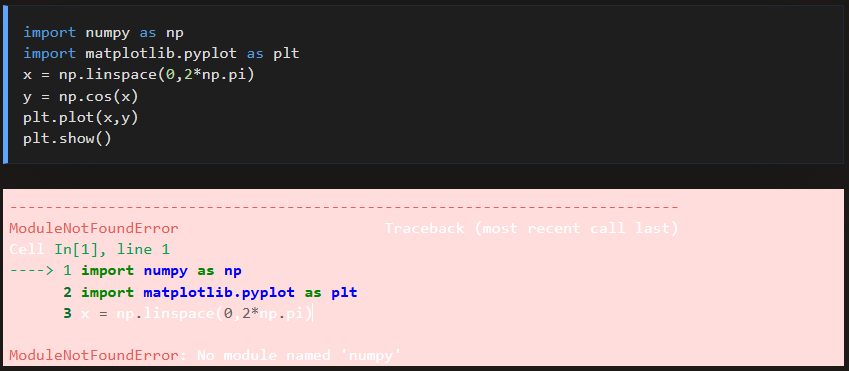
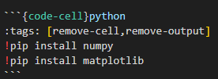

Markdown에서도 `code`가 돌아가도록 만들 수 있다. [이전에](#Code_Code-blocks) 사용했던 `{code}`나 `{code-block}`을 사용하지 않고, `jupyter notebook`처럼 `{code-cell}`을 사용한다.

## Enable executable markdown
실행 가능하게 하려면 가장 윗부분에 `---` 윗쪽에 해당 부분을 추가해 준다.
```{code} yaml
:filename: markdown-notebook.md
kernelspec:
  name: python3
  display_name: Python 3
---
```
해당 부분을 추가하면 전원 버튼이 생성된다.
이제 해당 부분을 클릭해주면 `Binder`라는 사이트에 연결해줘서 실행이 가능한 환경을 만들어 준다. 

```{code-cell}
a = [1,2,3,4,5]
b = 'Hello python!'
print(b)
```
위와 같이 간단한 결과는 바로 출력할 수 있다.
또한 `{eval}`을 사용해서 python환경에 저장된 변수를 활용 가능하다. 이를 사용하기 위해서는 `jupter lab`을 활용할 필요가 있다.

### Graph 그리기

처음 환경을 연결할때는 `numpy`나 `matplotlib`과 같은 library가 설치가 되어 있지 않아 설치를 시켜줄 필요가 있다.



```{code-cell}python
!pip install numpy
!pip install matplotlib
```

```{code-cell}python
import numpy as np
import matplotlib.pyplot as plt
x = np.linspace(0,2*np.pi)
y = np.cos(x)
plt.plot(x,y)
plt.show()
```

하지만 위와같이 `!pip`으로 되어 있는 cell은 보기 안좋다. 이를 해결하기 위해서 `tag`를 사용한다.

:::{table} Notebook cell tags with special meanings
:label: tbl:notebook-cell-tags

| Tag                | Description                                                                                                    |
| ------------------ | -------------------------------------------------------------------------------------------------------------- |
| `remove-cell`      | Remove the cell from the rendered output.                                                                      |
| `remove-input`     | Remove the code cell input/source from the rendered output.                                                    |
| `remove-output`    | Remove the code cell output from the rendered output.                                                          |
| `hide-cell`        | Hides the cell from the rendered output.                                                                       |
| `hide-input`       | Hides the code cell input/source from the rendered output.                                                     |
| `hide-output`      | Hides the code cell output from the rendered output.                                                           |
| `remove-stderr`    | Remove the code cell output stderr from the rendered output. See also project config |
| `remove-stdout`    | Remove the code cell output stdout from the rendered output. See also project config |
| `skip-execution`   | Skip this cell, when executing the notebook                                                                    |
| `raises-exception` | Expect the code cell to raise an Exception (and continue execution)                                            |

:::

아까와 같이 설치과정 결과물이 많아서 보기 힘들었던 `{code-cell}`을 `remove-output`나 `hide-cell`을 걸어서 실행할때 안보이게 할 수 있다.

::::{note}
```{code}python
:tags: [remove-cell,remove-output]
!pip install numpy
!pip install matplotlib
```
::::

```{code-cell}python
:tags: [remove-cell,remove-output]
!pip install numpy
!pip install matplotlib
```


markdown에서는 있지만 renderling된 화면에서 안보이는 것을 확인해 볼 수 있다.
