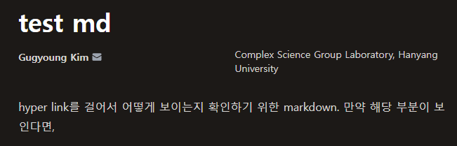

# 인용 확인용 문서
hyper link를 걸어서 어떻게 보이는지 확인하기 위한 markdown. 만약 해당 부분이 보인다면 아래의 각주[^test_md]를 통해 그림을 넣을 수도 있다.

:::{tip} 수식 인용 확인
:class: dropdown
{eq}`eq:eq_of_motion`
라벨의 이름이 겹치지 않으면 가능하며, 겹치는 경우 오류가 발생한다.
또한 ``으로 수식을 보여주는 것도 가능하다.


[](#equation-input)
:::

:::{tip} Table 인용 확인
:class: dropdown
{ref}`tbl:table`
또한 ``으로 테이블을 보여주는 것도 가능하다.

{ref}`table`
:::

:::{tip} Fig 인용 확인
:class: dropdown
{ref}`fig:Altair-graph`와 같이 이전에 사용한 그림을 인용하거나 ``를 사용해서 해당 문서에 embeding 할 수도 있다.


{ref}`sec:input_fig`
:::

:::{tip} Code-block 인용 및 임베딩 확인
:class: dropdown
{ref}`example-code`와 같이 다른 문서에 있는 코드를 인용하거나 ``을 통해서 해당 부분에 embeding할 수 있다.

[](#Code_Code-blocks)
:::

:::{tip} Theorem 인용 및 임베딩 확인
:class: dropdown
{ref}`def:Kuramoto-model`와 같이 다른 문서에 있는 코드를 인용하거나 ``을 통해서 해당 부분에 embeding할 수 있다.

[](#def:Kuramoto-model)
:::


:::{card} 🏷 원래 문서로 돌아가기
:link: ./00 Intro.md
이 부분을 클릭하면 보고 있던 화면으로 돌아갑니다.
:::


[^test_md]: **Test Fig**: 해당 화면이 보일것이다. 


## Cross-ref

다른 `.ipynb`에 있는 그림을 인용할 수 있다. 다른 `.ipynb`에 있는 그림을 인용하기 위해서는 아래와 같이
```python
#| label: img:test
points & bars
```
이런식으로 그림을 그려서 넣어서 `#|label: img:아무이름`으로 사용하면 되고, 그림을 그리는 경우는 기존 `Markdown`문법을 사용하거나 label과 caption을 넣기 위해서는 `MyST`문법을 사용하여 다음과 같이 그릴 수 있다.
::::
```{figure} #img:altair-horsepower
:label: fig-altair-horsepower
This figure has been included from [](./interactive-notebooks.ipynb) and can be referred to in cross-references through a different label.
```
::::
```{figure} #img:altair-horsepower
:label: fig-altair-horsepower
This figure has been included from [](./interactive-notebooks.ipynb) and can be referred to in cross-references through a different label.
```
:::{note} 해당 부분의 구조
`{figure} #img:example`
: `#` 은 이미 출력된 결과물을 인용하는 구조,  
`label`이 `img:example`이라고 출력한 결과를 가져온다.

`:label: fig-abcd`
: `:label:` 다음에 $\LaTeX$ 문법에서 사용하는 labeling과 동일하게 사용 가능

`This figure has been ~`
: caption에 해당되는 부분이며, 논문에 작성하 듯이 caption을 작성하면 됨
:::


라벨을 사용해 주는 경우, 해당 `label`이 다른 라벨과 겹치지 않아야 되며 다른 [문서](./99_test.md)에서도 사용이 가능하다.

:::{tip} 만약 그리만 넣고 싶을 경우
:class: dropdown
``을 사용해 주어 임베딩이 가능하며

`{ref}'example label'`
: 임의의 수식이나, 그림 등을 인용할 수 있다.
{ref}`img:altair-horsepower`
:::
